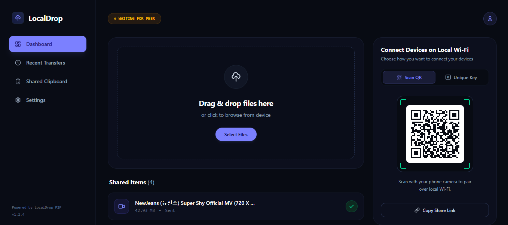

# LocalHub

A high-performance, privacy-focused, serverless peer-to-peer (P2P) file
and text/clipboard sharing web application. Built with WebRTC and the
Web Crypto API, LocalHub enables instant, end-to-end encrypted local and
remote transfers directly between browsers with zero file storage on
external servers.

## 📸 Preview

<p align="center">
  
</p>

## ✨ Features

-   **Direct P2P Transfer:** Ultra-fast file and text streaming that
    bypasses server bottlenecks using WebRTC DataChannels.
-   **End-to-End Encrypted (E2EE):** Hardware-accelerated client-side
    AES-GCM encryption with PBKDF2 key derivation.
-   **Smart Compression:** Automatic pre-transmission `gzip` stream
    compression to maximize throughput over remote networks.
-   **Real-Time Speed Metrics:** Live transfer speed monitoring (MB/s),
    duration calculation, and percentage indicators.
-   **Live Storage Gauge:** Real-time quota and browser storage
    monitoring using native Web Storage APIs.
-   **Instant Clipboard Sync:** One-click encrypted text sharing across
    connected devices.
-   **Persistent Transfer History:** Local transfer logging with browser
    `localStorage` integration.
-   **Modern & Responsive UI:** Sleek glassmorphism theme with complete
    mobile, tablet, and desktop optimization.

## 🛠️ Tech Stack

### Frontend

-   **React.js** (Vite)
-   **JavaScript (ES6+)**
-   **Tailwind CSS**
-   **Lucide React** (Icons)
-   **Web APIs:**
    -   WebRTC (`RTCPeerConnection`)
    -   Web Crypto API (`SubtleCrypto`)
    -   `CompressionStream` / `DecompressionStream`
    -   StorageManager API

### Backend & Infrastructure

-   **Pusher Channels:** Real-time WebSockets for WebRTC SDP and ICE
    candidate signaling.
-   **Vercel Serverless Functions:** Stateless API signaling endpoint
    (`/api/signal.js`).

## 📂 Project Structure

``` text
localhub/
├── api/
│   └── signal.js             # Vercel Serverless Function for Pusher signaling
├── public/
├── src/
│   ├── assets/
│   ├── components/
│   │   └── views/
│   │       └── RecentTransfersView.jsx
│   ├── hooks/
│   │   └── useWebRTC.js      # Optimized P2P connection & high-speed streaming hook
│   ├── utils/
│   │   └── encryption.js     # Web Crypto AES-GCM & Gzip compression utilities
│   ├── App.jsx
│   └── main.jsx
├── package.json
├── vite.config.js
└── README.md
```

## ⚙️ Installation

### 1. Clone the repository

``` bash
git clone https://github.com/YOUR_GITHUB_USERNAME/localhub.git
```

### 2. Navigate to the project directory

``` bash
cd localhub
```

### 3. Install dependencies

``` bash
npm install
```

### 4. Configure environment variables

Create a `.env` file in the root directory and add your Pusher
credentials:

``` env
VITE_PUSHER_KEY=your_pusher_key
VITE_PUSHER_CLUSTER=your_pusher_cluster
PUSHER_APP_ID=your_pusher_app_id
PUSHER_SECRET=your_pusher_secret
```

### 5. Start the development server

``` bash
npm run dev
```

The application will be available at your local development URL, such as
`http://localhost:5173`.

## 🎯 Purpose

LocalHub was developed to demonstrate advanced frontend engineering,
browser cryptography, low-latency streaming optimization, and serverless
WebRTC signaling architecture without relying on third-party relay
servers or paid backends.

## 🔮 Future Improvements

-   **TURN Server Integration:** Add TURN relay fallbacks for strict
    corporate firewall/NAT traversal.
-   **Chunked Stream Decryption:** Implement `WritableStream` and File
    System Access API to support multi-gigabyte (2GB+) transfers without
    tab RAM limits.
-   **Folder Transfer Support:** Automatically zip and stream whole
    directory contents.
-   **PWA Capability:** Turn LocalHub into an installable Progressive
    Web App with offline support.

## 👨‍💻 Author

**Shehroz**

-   GitHub: [m-shehroz-teach/]((https://github.com/m-shehroz-teach)
-   Live Demo:
    [localhub-ten.vercel.app](https://localhub-ten.vercel.app/)
-   LinkedIn: Muhammad Shehroz
